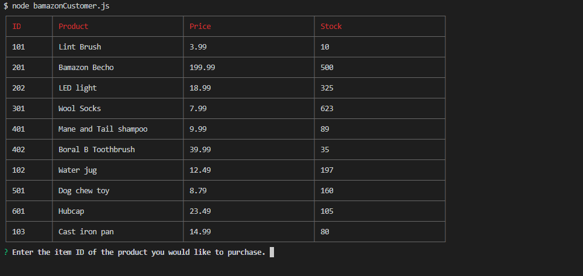
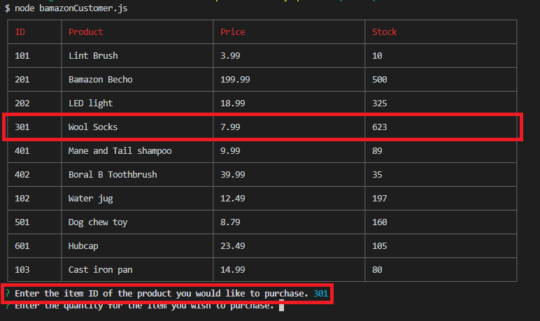
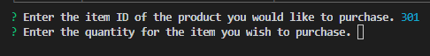
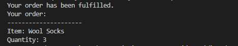

# mysql-store
Amazon like database with updates to the MySQL table. 

Once you initial the app in your terminal it will present you with a table of the items in stock and shows 
price and quantity available.

Once you have entered in the ID number of the item you would like to purchase it will ask how many would like to order next.

The order is completed

Once your order is fulfilled the the MySQL table is updated. I console logged to event to show the update.

